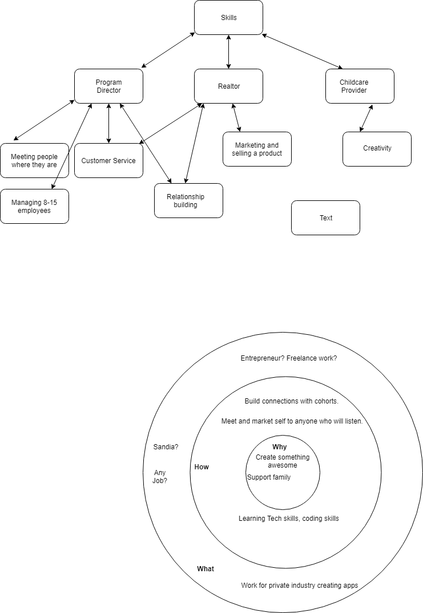

# Quantitative and Qualitative accomplishments

## Quantitative

* $1,000,000 in property sales in one summer.

* Managed program of 100 students and 20 employees. 

* Married for 4 years. 

## Qualitative

* Love to meet people and build relationships. Extroverted nature. Strength in so far as I am comfortable talking to anyone. 
Weakness, can be a pleaser.

* Active, and kinisthetic learner. Constantly moving/fidgeting, ADHD. Strength: full of energy ready to go. Weakness: lose attention to tihngs.

* Life long learner/sponginess. Love to learn new things or stay up to date on things im passionate about. Strength: expanding mindset and 
and learning new concepts. Weakness: can "go down the rabit hole" and lose focus on original task. 

## Paragraph about passion project. 
  Current passion projects of mine is carpentry and creating things my family can use. I recently built a sandbox for our back yard for my daughter, I also built our dining room table. I love just creating with my hands, using the tools and quite often messing up. Alot. Finding plans and then adapting them to suit my purpose or even creating my own blueprints to work from is satisfying. 

## Version 1 Elevator pitch.
  I'm Brian Alexander.
  
  Create android apps that modern businesses or consumers would want to use. 
  
  I love to build things with my hands. Creating apps and watching people interact with them in new and different ways excites me. 
  
  Use creative and innovative ideas, while collaborating with peers to make excellent content. 
  
  Do you have a business card? Could we stay in touch and get coffee maybe discuss some ideas.

[Thought Map and Golden Circle Excercise in PDF](Thought Map Pro Dev.pdf)

