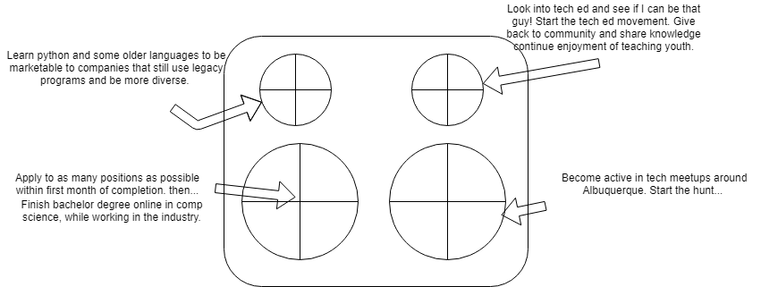

## Persuasion Workshop 

### Four burners activity.

[Burners Activity](docs/burnersactivity.pdf)

### Two questions to ask people in the industry?
* What programing langauage should I focus on and learn first after Java?
* What is one simple mistake I could avoid doing when I first start out?
* What kind of opportunities are in New Mexico?
* What does it take to get a clearance at the labs? 

### Finding two orgs in Albuquerque.
* Ultramain Systems, I have a friend of mine working there now, currently asking about opportunites and what they do. I intivited Rebecca to our capstone presentation and asked her for some information and a connection to their HR and to get more information. Rebecca said she woul try her best to attend our graduation, she was excited being a prior cohort graduate. 

* Tried reaching out t a company called Aviata, they have some focus in Android development as well as Java. Besides job postings I wasnt too sure which person to reach out to. I wonder if there are any connections of someone who has gone through the bootcamp? Would be interested to learn more and see what they do and how I fit. 

* I spoke with my mother this weekend about anyone she knew in the CS realm of Sandia and Los Alamos. She has been speaking with her coworkers about my bootcamp. It was a little intimidating when she told me, "Oh I asked our CIO, for DoE, what he thought about coding bootcamps when you first started and he said he liked how the people coming out of them usually had atypical coding backgrounds and approached problems differently" She is giving me the number of a friend that runs a division at Sandia. I also was talking to my friend's father who is a retired programmer from Los Alamos and still does some contracting, he told me the next time I was in Los Alamos we could get with some people from his old division. I got to ask him about what languages they were using, what the work environment was like. 

I know at any company I can bring value, through hardwork, new ways of approaching problems as well as excellent teamwork and leadership skils.I feel as if I am a very easy and fun person to be around, and I love to collaborate and work together, giving others the time to shine but also know when to take the lead. 
